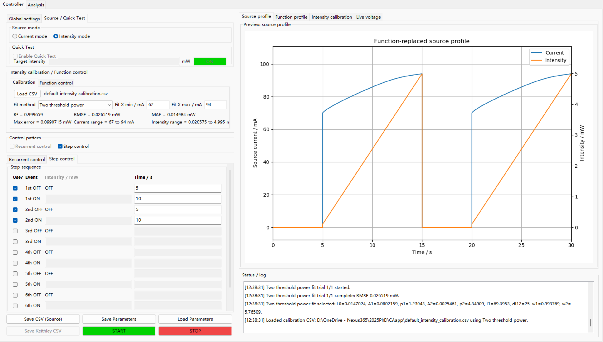
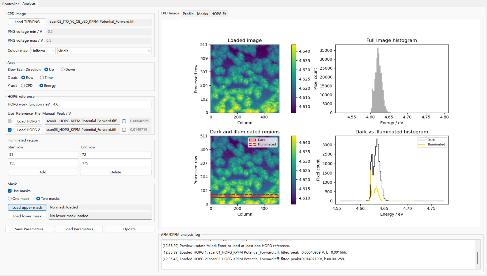
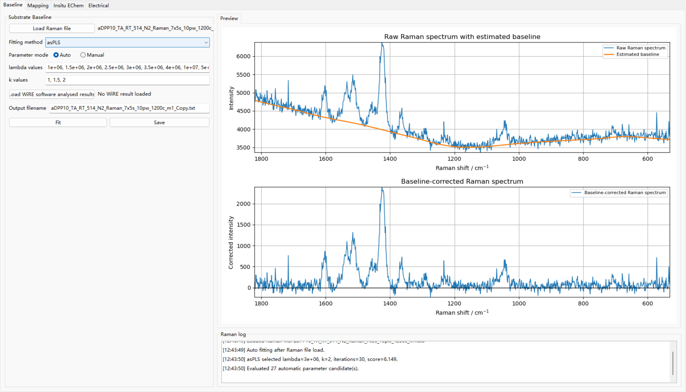
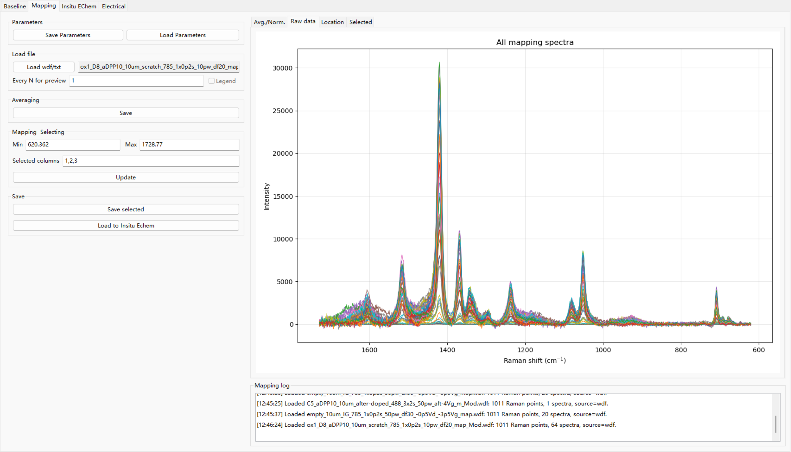
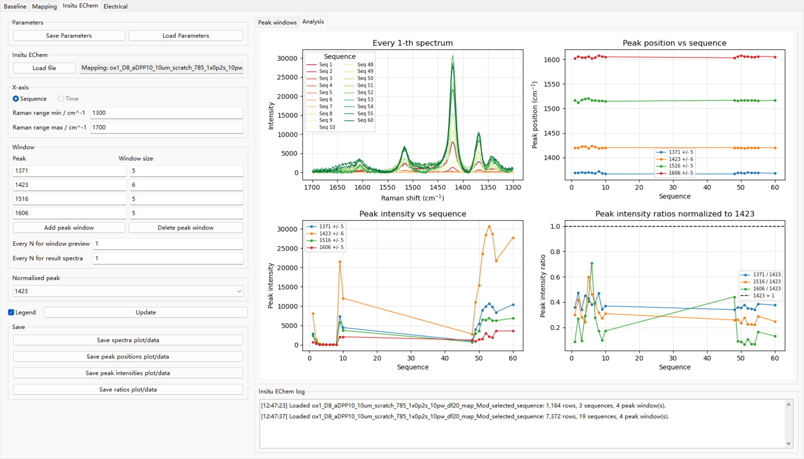
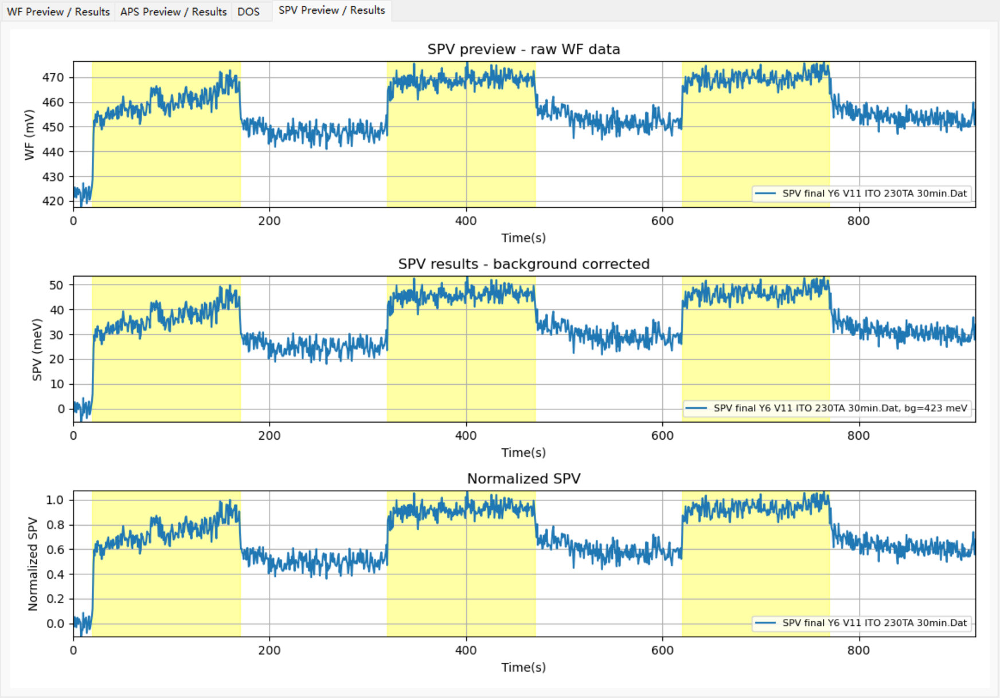
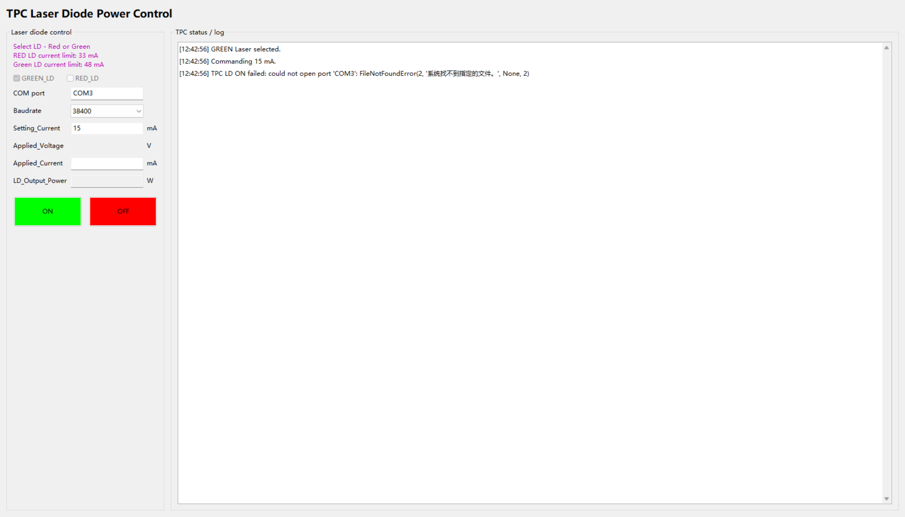

# Controllers & Analysers

**English** | [简体中文](README.zh-CN.md)

Controllers & Analysers is a local desktop app for our lab experiment-control and data-analysis work. It is meant to be opened like a normal Windows program: choose the workspace you need, load your data or set your experiment parameters, check the preview, and save the result.

## First Time Opening The App

If you already have a `ca_app.lnk` shortcut, double-click it to open the app.

If this is your first time using this copy of the project:

1. Double-click `create_ca_app_shortcut.bat`.
2. If the window asks for a Python path, paste either the full `python.exe` path or the Anaconda folder path. If you are not sure, ask the maintainer.
3. Wait until it says the shortcut was created.
4. Double-click `ca_app.lnk` to open Controllers & Analysers.
5. You may copy `ca_app.lnk` to your Desktop for easier access.

The app window title shows the current version: `Controller & Analysers v16.17.260608.0011`.

## Everyday Use

1. Open `ca_app.lnk`.
2. Pick a workspace from the `View` menu.
3. Use the left side to load files or enter settings.
4. Use the right side to check plots, tables, previews, and logs.
5. Save outputs with the save buttons in that workspace.
6. Use `Save Parameters` if you want to keep your current settings for later.
7. Use `Load Parameters` to restore a settings file you saved before.

The `Restore` menu controls what the app remembers when it opens next time:

- `View`: remember only the last workspace.
- `Tab`: remember the last workspace and selected tabs.
- `Parameters`: remember supported file paths and typed settings.

The app can also keep simple local usage logs in the software folder's `usage_logs` folder so the maintainer can see which workspaces are slow or confusing after a few days of real use. These logs record actions such as opening a workspace, loading or saving a file, and how long fitting takes. They do not record your raw data, full file paths, or hardware measurement traces. Use `About -> Open Usage Log Folder` to find them, and use `About -> Usage Logging` to turn this off or on.

## Which Workspace Should I Use?

| If you want to... | Use this workspace |
| --- | --- |
| Run AFM/KPFM light or current timing with Keithley hardware | `View -> AFM/KPFM -> Controller` |
| Analyse AFM/KPFM CPD images, regions, masks, profiles, or HOPG fitting | `View -> AFM/KPFM -> Analysis` |
| Correct the baseline of one Raman spectrum or a Raman TXT/WDF sequence | `View -> Raman -> Baseline` |
| Load Raman mapping data, save Origin-friendly tables, and export selected spectra | `View -> Raman -> Mapping` |
| Analyse Raman sequence data during electrochemistry experiments | `View -> Raman -> Insitu EChem` |
| Preview Raman electrical CSV traces such as V_Gate and V_Drain | `View -> Raman -> Electrical` |
| Analyse APS, DWF, DOS, workfunction, or SPV data | `View -> APS` |
| Control the red or green TPC laser diode | `View -> TPC` |

## Before Using Hardware

Only use hardware controls when the device is connected correctly and the current/compliance settings are safe.

For AFM/KPFM Controller, check these before pressing `START`:

- COM port, usually `COM3`
- baudrate, usually `38400`
- voltage compliance
- internal max current
- current mode or intensity mode
- calibration file, if using intensity mode
- preview of the planned source profile

For TPC Control, check the selected laser diode, current setting, current limit, COM port, and baudrate before turning output on.

## Gallery

| AFM/KPFM Analysis | Raman Baseline |
| --- | --- |
|  |  |

| Raman Mapping | Raman Insitu EChem |
| --- | --- |
|  |  |

| APS/SPV Analysis | TPC Controller |
| --- | --- |
|  |  |

## Help

If the shortcut does not open, if Python is missing, or if a hardware device does not respond, ask the maintainer before changing files or hardware settings.

If the maintainer asks for usage logs, open `About -> Open Usage Log Folder` and send the recent `usage_*.jsonl` files.

