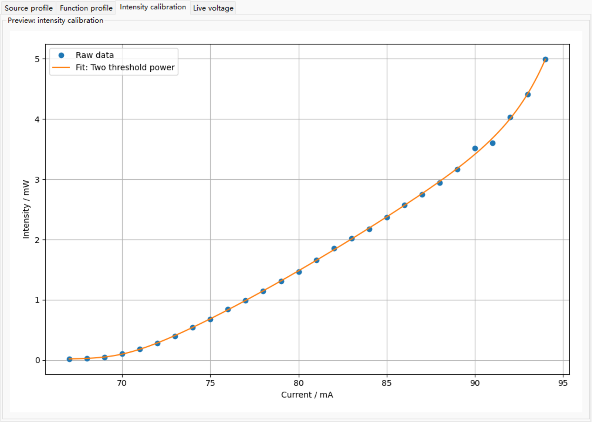
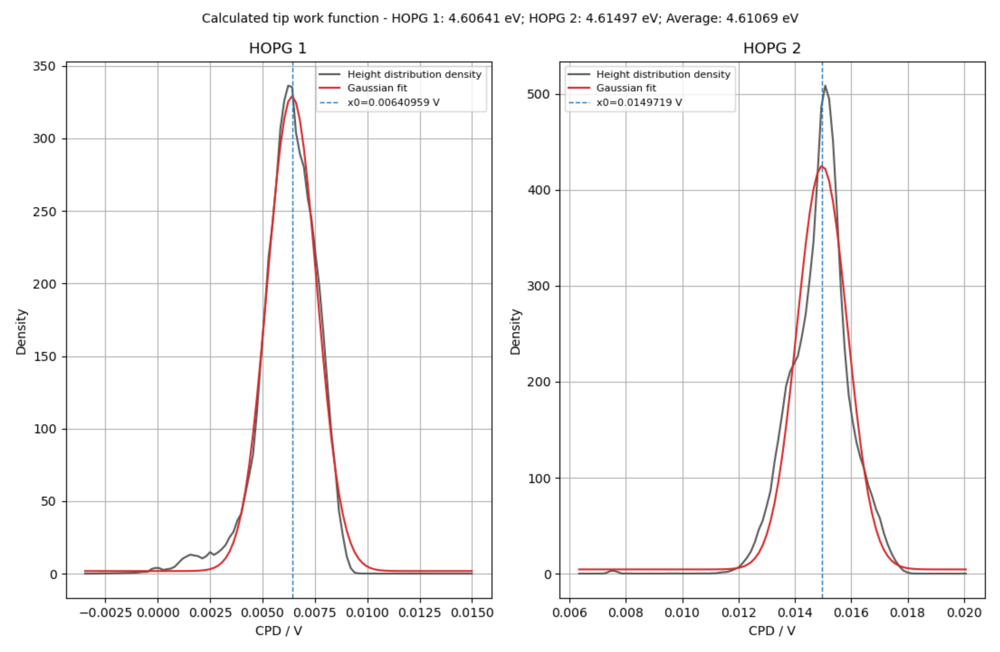
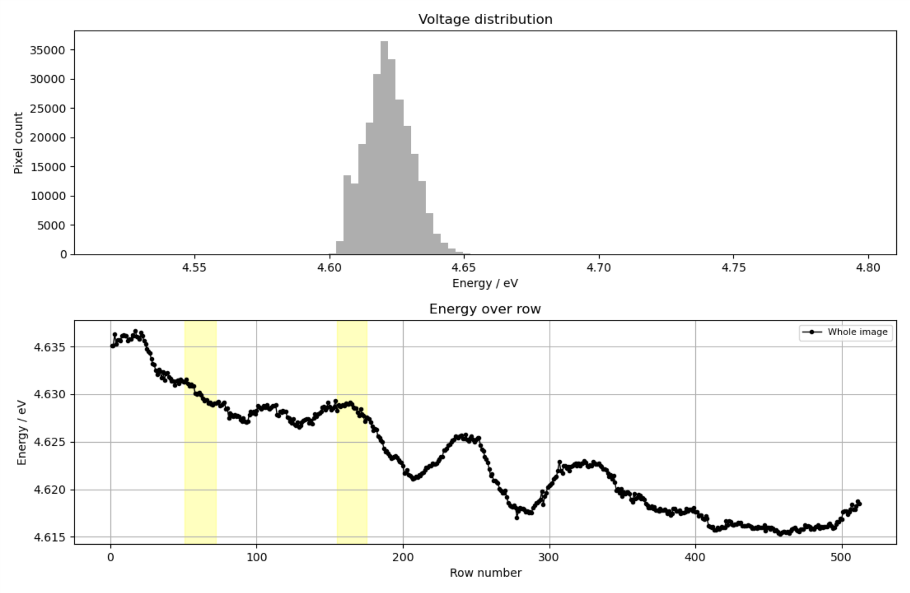
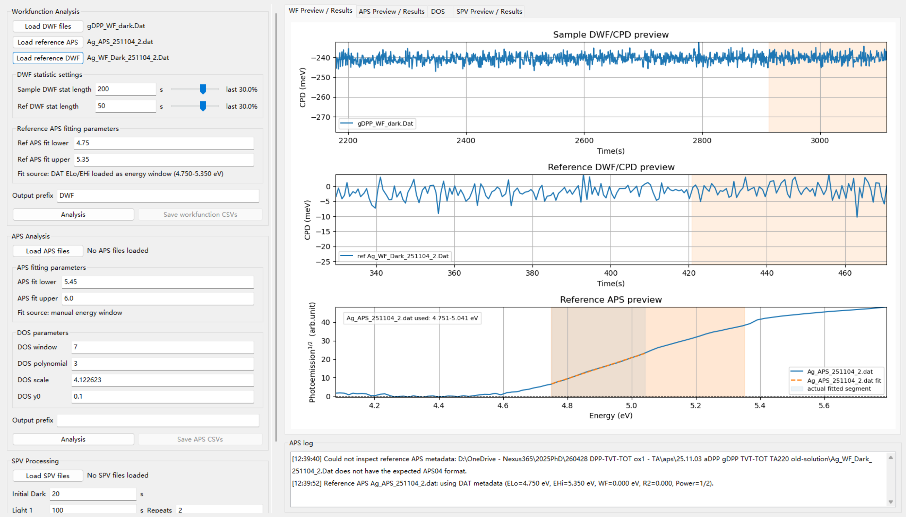
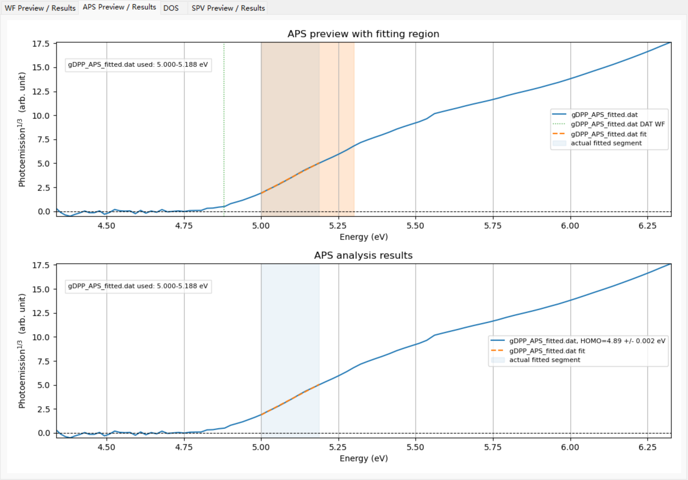
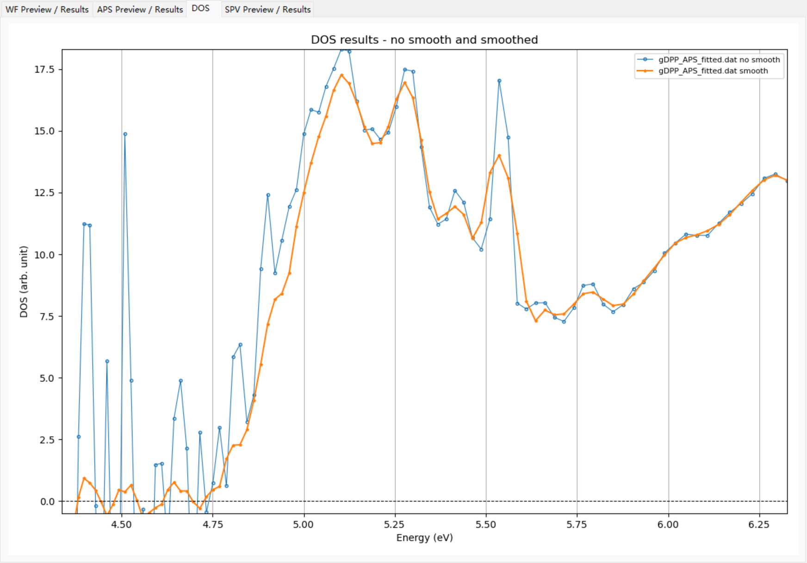
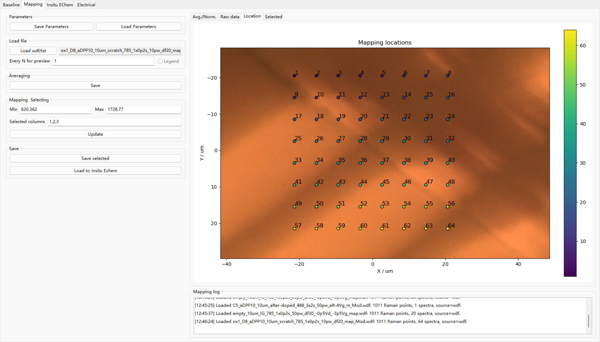
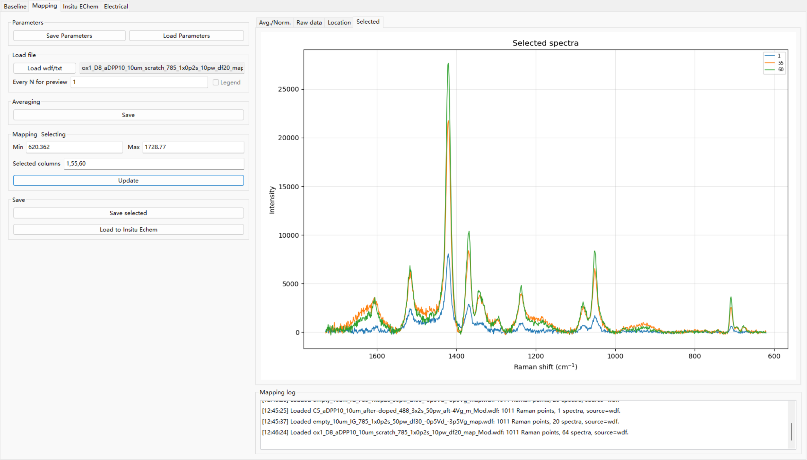
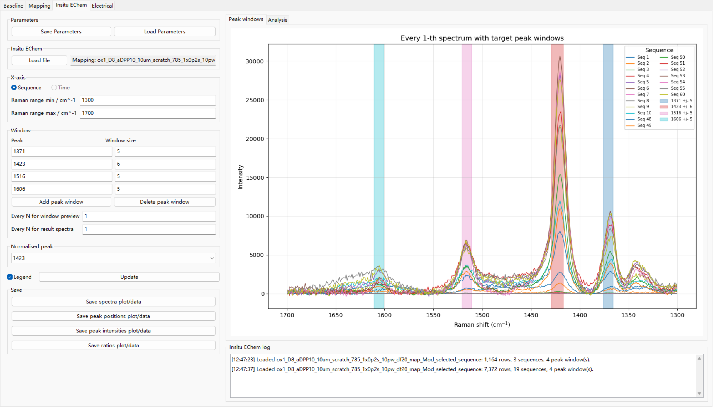

# Controllers & Analysers

[English](README.md) | **简体中文**

Controllers & Analysers 是一个面向科研实验的桌面软件，用于把实验控制、数据预览和后续分析集中在同一个 wxPython 图形界面中。它目前集成了 AFM/KPFM Keithley 控制、AFM/KPFM CPD 图像分析、APS/DWF/SPV 分析、TPC 激光二极管控制、Raman 基线校正、Raman Mapping，以及原位电化学 Raman 序列分析。

这个项目来自一个很实际的实验室需求：一次实验往往需要在仪器控制界面、表格、绘图脚本、图像软件和手动文件转换之间来回切换。Controllers & Analysers 的目标是把这些重复流程放进一个统一的软件里，用实时预览、参数保存、安全的硬件默认值和适合后续科研分析的导出格式来减少手动操作。

当前 v14 版本保留了早期 v10 重构中已经测试过的 AFM/KPFM Keithley 控制行为，同时扩展为更完整的分析工作平台。

## 软件能做什么

从整体上看，这个软件主要解决三类问题：

1. **控制实验**  
   建立 AFM/KPFM 电流或光强时序，预览输出曲线，通过串口运行 Keithley 源表，并实时观察测得电压。

2. **分析数据**  
   在专门的 GUI 工作区中处理 CPD 图像、APS/DWF/SPV 数据、Raman 光谱、Raman mapping 数据和原位电化学 Raman 序列。

3. **提高可重复性**  
   保存参数、恢复工作区状态、导出 CSV/TXT/PNG 文件，并把计划输出曲线和真实硬件测量数据分开管理。

## 功能概览

| 工作区 | 主要功能 |
| --- | --- |
| **AFM/KPFM Controller** | Keithley 电流源控制，电流模式或标定光强模式，Quick Test，循环与阶梯时序，函数曲线叠加，实时电压绘图，源曲线导出，测量数据 CSV 导出 |
| **AFM/KPFM Analysis** | CPD TIFF/PNG 加载，CPD 或能量显示，HOPG 参考拟合，光照区域标记，mask 工作流，暗/亮区域直方图，行/时间剖面 |
| **APS/DWF/SPV** | APS、DWF、workfunction、DOS 和 SPV 分析、绘图与 CSV 导出 |
| **TPC Control** | 通过 Keithley 控制红/绿激光二极管电流，并处理电流上限 |
| **Raman Baseline** | Raman TXT 加载，`asPLS`、`drPLS`、`Polynomial/backcor` 基线校正，可叠加 WiRE 软件分析结果，导出校正后光谱 |
| **Raman Mapping** | WiRE WDF/TXT mapping 导入，光谱展开，平均/归一化预览，raw/location/selected 标签页，Origin 友好 TXT 导出，选中光谱传递到 Insitu EChem |
| **Raman Insitu EChem** | 序列/WDF 导入，峰窗口提取，峰位和峰强追踪，归一化强度比，序列/时间绘图，PNG 和 CSV 导出 |

## 这个项目为什么有用

很多科研脚本只解决工作流中的某一步。这个项目尝试把完整流程连接起来：

- **实验前：** 在发送到硬件之前先建立并预览源输出曲线。
- **实验中：** 用内部电流上限约束所有源电流命令，并显示实时电压/电流上下文。
- **实验后：** 不需要手动重排文件，就能分析图像和光谱。
- **跨会话：** 可按需要恢复标签页、参数和已加载路径，但绝不会恢复硬件输出状态。

它不是商业化仪器套件，而是围绕真实实验室日常流程开发的科研软件。这里很多细节很重要：被禁用的输入框不能被解析，OFF 阶段不能查询 Keithley，Raman 选中序列号不能被重新编号，真实硬件测量数据只能在用户明确点击保存时写入文件。

## 截图

界面采用固定的左侧控制区和右侧预览区布局，因此即使实验和分析流程变复杂，每个工作区仍然能保持清晰。


*AFM/KPFM Controller：源设置、序列控制、标定/函数工具和实时预览集中在同一个工作区。*


*Raman Insitu EChem：在同一分析视图中显示序列光谱、峰位、峰强和归一化 ratio。*

### 完整截图

#### AFM/KPFM









#### APS/DWF/SPV








#### Raman









#### TPC


## 安装

已知可运行环境：

- Windows
- Python 3.13.x
- wxPython 4.2.x
- pyserial 3.5
- numpy
- matplotlib
- scipy
- Pillow
- renishawWiRE，用于读取 `.wdf` Raman 文件

在仓库根目录执行 editable 安装：

```cmd
pip install -e .
```

如果新电脑上 wxPython 安装困难，可以先安装与当前 Python 版本匹配的 wxPython wheel，然后再运行 editable 安装。

## 运行

从源码目录直接运行：

```cmd
python run_ca_app.py
```

或者在 editable 安装后运行：

```cmd
ca-app
```

当前打包应用位于：

```text
src/ca_app/
```

顶层 GUI shell 位于：

```text
src/ca_app/gui/main_frame.py
```

## 快速开始

1. 用 `python run_ca_app.py` 启动软件。
2. 从 `View` 菜单选择需要的工作区。
3. 对于分析工作流，先加载数据文件并检查右侧预览，再保存结果。
4. 对于硬件工作流，在打开输出前确认 COM 口、波特率、电压 compliance 和内部最大电流。
5. 使用 `Save Parameters` / `Load Parameters` 保存或加载手动参数文件。
6. 使用 `Restore` 菜单控制软件启动时自动恢复多少状态。

## AFM/KPFM Controller

AFM/KPFM 控制器通过 RS-232 串口控制 Keithley 源表。

核心硬件模式：

```text
Source: current
Measure: voltage
Default COM port: COM3
Default baudrate: 38400
Default voltage compliance: 5.0 V
Default internal max current: 110.0 mA
```

Keithley 始终接收电流命令。在光强模式下，目标光强会先通过已加载的标定模型转换为所需源电流，然后才发送到硬件。

支持的控制方式：

- **Quick Test：** 独立的 ON/OFF 硬件测试。
- **Recurrent control：** 重复 ON/OFF 时序。
- **Step control：** 基于多行设置的 ON/OFF 阶梯时序，也是默认基础模式。
- **Function control：** 把 `f(x)` 曲线叠加到 recurrent 或 step 的 ON 阶段上。

Function control 不是独立的时序模式。它会替换 ON 阶段的电流或光强值，但保留 recurrent 或 step 中定义的 ON 持续时间。启用 Function control 后，基础 ON 数值输入框会被禁用，因为输出值由函数曲线提供。

## 标定与函数曲线

默认标定文件：

```text
src/ca_app/resources/default_intensity_calibration.csv
```

推荐标定 CSV 格式：

```text
Current_mA,Intensity_mW
```

加载器也接受任意两个数值列，其中第一列数值为电流 mA，第二列数值为光强 mW。

默认标定拟合范围：

```text
67 to 94 mA
```

可用标定方法：

- `Empirical power-exp`
- `Two threshold power`
- `Two stage softplus slope`
- `Generalized exponential power`
- `Polynomial degree 3`
- `Interpolation`
- `Linear`
- `Quadratic`
- `Cubic`

这些 empirical 模型是针对测量标定数据的平滑插值拟合，不是激光二极管物理方程，不应在远离实测范围的位置外推使用。

默认函数曲线：

```text
f(x) = x*m+b
X min = 0
X max = 180
Y min = 0.1
Y max = 4.99
```

`Fit it` 按钮可以求解带参数的表达式，例如：

```text
x*m+b
a*x^2+b*x+c
```

拟合完成后，表达式会被替换为数值表达式，使预览、验证、CSV 导出和实际运行使用同一个安全表达式求值器。

## 硬件安全模型

这个项目把硬件行为保持为显式、可检查的逻辑。

- 所有源电流命令都会与 `Internal max current / mA` 比较。
- Quick Test 和 Function control 互斥。
- Quick Test 和序列运行不会同时进行。
- 点击 `START` 后，软件会在打开串口前冻结本次运行快照。
- 运行期间修改标定或函数设置只会更新 GUI 预览，不会改变当前 Keithley 输出电流。
- OFF 阶段发送 `:OUTP OFF`，不会发送 `:READ?`、`:INIT` 或 `:FETCH?`。
- OFF 阶段记录本地软件已知的 `0 mA` 源电流行，测量电压/电流留空。
- 正常结束、STOP 和异常清理都会尝试先把源电流设为 `0 mA`，再发送 `:OUTP OFF`。
- Keithley 真实测量数据只有在点击 `Save Keithley CSV` 时才会保存。

连接硬件前，请确认 COM 口、波特率、电压 compliance、内部电流上限、接线和光强标定都适合当前真实实验设置。

## AFM/KPFM 图像分析

AFM/KPFM Analysis 标签页可以加载 TIFF 或 PNG 格式 CPD 图像。TIFF 加载会尝试自动寻找图像尺寸匹配的原始 metadata/tag 数组。PNG 加载会使用用户输入的电压最小/最大值把像素值重新缩放。

主要功能：

- CPD 或 Energy 显示。
- Energy 模式下的 HOPG 参考峰拟合。
- 慢扫描方向处理。
- 行号或时间 x 轴剖面。
- 光照区域标记。
- 单 mask 和双 mask 工作流，包括 inverse 和 middle mask。
- 暗/亮区域直方图比较。
- 稳健的预览色阶，减少极端值对 colourbar 的影响。
- 可选择图像 colormap。

## Raman 工作流

Raman 工作区包含四个标签页：

```text
Baseline
Mapping
Insitu EChem
Electrical
```

`Electrical` 标签页目前为预留空白页面。

### Raman Baseline

Raman Baseline 加载至少包含两列数值的文本文件：

```text
#Wave    #Intensity
1820.535156    3780.142822
...
```

可用方法：

- `asPLS`
- `drPLS`
- `Polynomial/backcor`

Auto 模式会评估当前界面可见的候选参数列表。Manual 模式每个参数只接受一个值，并且只在点击 `Fit` 后重新拟合。

预览内容包括：

- 原始 Raman 光谱和估计基线
- 基线校正后的 Raman 光谱，可叠加 WiRE 软件分析结果

保存时只写出校正后的两列光谱。默认输出文件名为原始文件名加 `_Copy.txt`。

### Raman Mapping

Raman Mapping 支持：

- WiRE WDF mapping 文件
- 包含 `#X`、`#Y`、`#Wave`、`#Intensity` 的 WiRE stacked TXT mapping 文件

软件会把 mapping 光谱展开成宽表：第一列为 wavenumber，后续列为单条光谱，最后包含平均强度和归一化强度。

预览标签页：

- `Avg./Norm.`
- `Raw data`
- `Location`
- `Selected`

选中光谱使用 1-based 列号，并支持连续范围：

```text
1,2-4,5
45-60
```

选中列号在绘图、TXT 导出以及传递到 Insitu EChem 时都会保留，不会重新编号。

### Raman Insitu EChem

Insitu EChem 接受 Raman 序列文本文件：

```text
#Time    #Wave    #Intensity
0.000000    2063.746094    3895.066162
...
```

也接受：

```text
#Sequence    #Wave    #Intensity
1.000000    1728.768555    64.341232
...
```

以及 WDF 序列文件。

分析会在用户定义的 Raman shift 窗口内提取局部最大峰，并绘制：

- 每 N 条光谱及峰窗口
- 峰位 vs sequence 或校准时间
- 峰强 vs sequence 或校准时间
- 归一化到选定峰的强度比

默认峰窗口：

```text
1371 +/- 5
1423 +/- 6
1516 +/- 5
1606 +/- 5
```

当输入使用 `#Sequence`，或数据来自 Mapping/WDF 序列传递时，软件会强制使用 Sequence 模式并禁用 Time x 轴选项。Sequence label 会被当作真实编号保留，不会重新映射成 `1..N`。

## 保存、恢复与导出

手动参数文件使用 JSON，且与自动 app-state restore 相互独立。

`Restore` 菜单控制软件启动时自动恢复多少状态：

- `View`：只恢复上次打开的顶层工作区。
- `Tab`：恢复工作区和已选择的 notebook 标签页。
- `Parameters`：在支持的工作区中恢复标签页、已加载文件路径、输入值、选项和勾选框。

软件不会通过 app-state restore 保存或恢复硬件输出状态、测量电压、运行日志、实时绘图数据或真实测量 run data。

重要导出路径：

- `Save CSV (Source)`：只保存计划源输出曲线。
- `Save Keithley CSV`：只有点击时才保存 AFM/KPFM 的真实测量 run data。
- Raman Mapping `Save`：导出 Origin 友好的 TXT。
- Raman Mapping `Save selected`：导出选中 Raman sequence TXT。
- Raman Insitu EChem 每个 save 按钮都会写出一个 PNG 和一个 CSV。

## 项目结构

```text
run_ca_app.py
  源码目录启动器。

src/ca_app/app.py
  console script 使用的应用入口。

src/ca_app/constants.py
  可安全导入的应用默认值。

src/ca_app/gui/main_frame.py
  顶层窗口、View 菜单、Restore 菜单、工作区切换、
  app-state 持久化和 About 对话框。

src/ca_app/gui/panels/
  独立 wxPython 工作区面板。

src/ca_app/core/
  分析、标定、函数曲线和数据处理逻辑。

src/ca_app/hardware/
  Keithley 串口设置和 SCPI 命令辅助函数。

src/ca_app/io/
  文件导入/导出边界。

src/ca_app/resources/
  内置标定 CSV 和示例参数资源。

src/ca_app/runtime/
  未来 worker service 的计划抽取区域。

tests/
  针对核心逻辑和 GUI 状态行为的非硬件测试。
```

## 开发

运行非硬件测试：

```cmd
python -m unittest discover -s tests
```

运行编译检查：

```cmd
python -m compileall src tests
```

测试覆盖分析逻辑、标定/函数曲线行为、Raman 工作流、TPC 电流处理、COM 口默认值和工作区状态恢复。

## 文档

更多说明见：

- [docs/architecture.md](docs/architecture.md)
- [docs/hardware_safety.md](docs/hardware_safety.md)
- [docs/calibration_models.md](docs/calibration_models.md)
- [src/ca_app/runtime/README.md](src/ca_app/runtime/README.md)

## 项目状态

这是一个仍在发展的科研软件。它围绕真实实验流程设计，并包含核心逻辑的非硬件测试；但任何硬件操作在实际使用前仍必须根据连接的仪器、样品和实验条件重新检查。

如果你想参与开发，建议先从分析和文件处理工作流开始；在修改控制器行为前，请先认真阅读硬件安全相关说明。
